# Hexo + GitHub + Netlify 配置博客

## 前言：本文主要介绍两种方法搭建博客。

- 本地无需安装NodeJS和Hexo。
    - 工具：Git + GitHub + StaticGen + Netlify 

- 本地安装NodeJs + Hexo。
    - 工具：Hexo + NodeJS + Git + GitHub + Netlify

二者的区别在于前者在本地是没有Hexo仓库（假象）的，全部文件只在GitHub仓库中。但之所以是假象，是因为你编辑的时候需要将该项目拉到(pull)本地，进行编辑，此时，该项目就等于是Hexo仓库了。

而后者则是现在本地创建Hexo仓库，然后使用IDEA打开该文件夹，然后手动推送到GitHub仓库中。

区别在于顺序不同，而相关软件的安装是否影响结果，，，还不清楚，因此建议使用第二种。

使用IDEA方便可以图形化使用Git，使用Netlify则可以省略Hexo命令，因为Netlify使用WebHook钩取你的GitHub的仓库文件变动，自动生成静态文件，省去了Hexo的命令使用。

## 安装NodeJS

### 1. Node.js 配置环境变量

```
Win10 exe安装时，默认添加。
```

### 2.	换源

```
#以下命令若不做特殊声明，皆在Git Bash中执行
$:npm config set registry http://registry.npm.taobao.org/
```


## 安装Git

### 1.	安装

```
无脑下一步就好了吧。。。
```

### 2.	配置

## 安装与配置Hexo

### 1.	安装Hexo

```
$:npm install -g hexo-cli
```

### 2.	配置Hexo环境变量

#不更改Nodejs配置情况下，默认的全局配置在安装路径下

```
$:${NodeJs安装位置}\node_global\node_modules\hexo-cli\bin  添加入Path中
```

### 3.	初始化hexo

#### 1.创建空文件(一定要为空文件，若不是则清空)

```
空文件夹为：D:\HexoBlog
```

#### 2.	进入文件夹，并初始化

```
$:cd /d/HexoBlog
$:hexo init
$:npm install
```


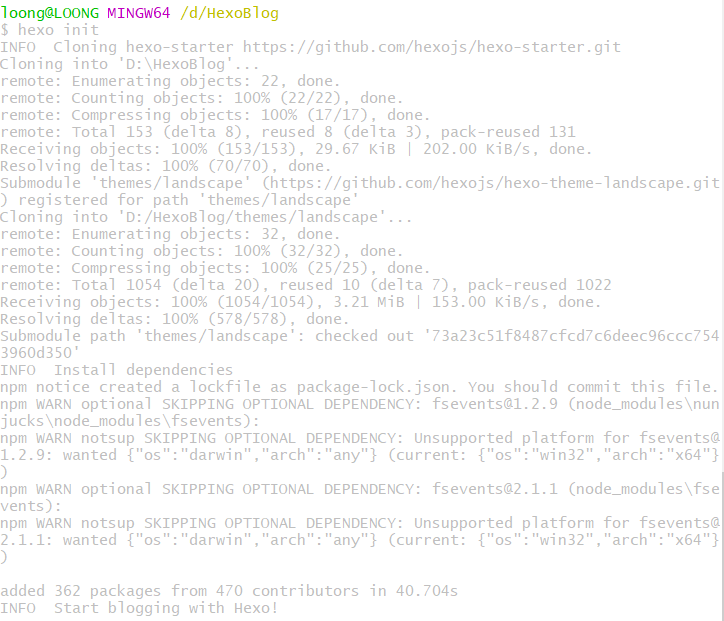


#### 3.	文件目录说明

```
_config.yml：		站点的配置文件，需要备份；
themes：				主题文件夹，需要备份；
source：				博客文章的 .md 文件，需要备份；
scaffolds：			文章的模板，需要备份；
package.json：		安装包的名称，需要备份；
node_modules：		是安装包的目录，在执行 npm install 的时候会重新生成，不需要备份；
public：				是 hexo g 生成的静态网页，不需要备份；
.deploy_git：		同上，hexo g 也会生成，不需要备份；
```

#### 4.	站点文件配置仓库

这一步主要是为了方便，否则添加一篇文档还要打开IDEA，添加此命令就可以在Git Bash中使用Git命令就可以推送到GitHub中。

```
deploy:
  type: git #部署方式
  repo: https://github.com/xxx.git #github仓库
  branch: master #部署分支
```

#### 5.	修改主题

- 进入相关网站查询你中意的主题[https://hexo.io/themes/](https://hexo.io/themes/)

- Github上查找主题仓库，并clone

```
$:cd /d/HexoBlog
$:git clone https://github.com/iissnan/hexo-theme-next themes/next
```

- 修改主题

```
$: vim _config.yum
#将theme后默认的主题名landscape 更改为你上一步中的${主题名}(文件夹名)  并保存退出
:theme: next		//修改主题名为next
```

- 添加.gitmodules文件（**这个文件应该是在Netlify上部署时特有的**）

```
[submodule "themes/next"]
	path = themes/next
	url = https://github.com/iissnan/hexo-theme-next.git
```

## 配置GitHub及Netlify

### 1.	创建GitHub/Netlify

#注意：选择第一种方法构建时，是无需提前创建仓库的。第二种则需要。

#### 1.	第一种方法

- 进入[https://www.staticgen.com/](https://www.staticgen.com/)官网

- 选择Hexo，点击Netlify进行部署

    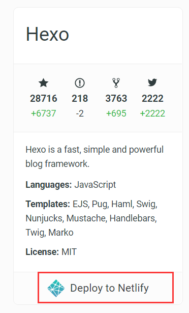

- 关联GitHub账号

    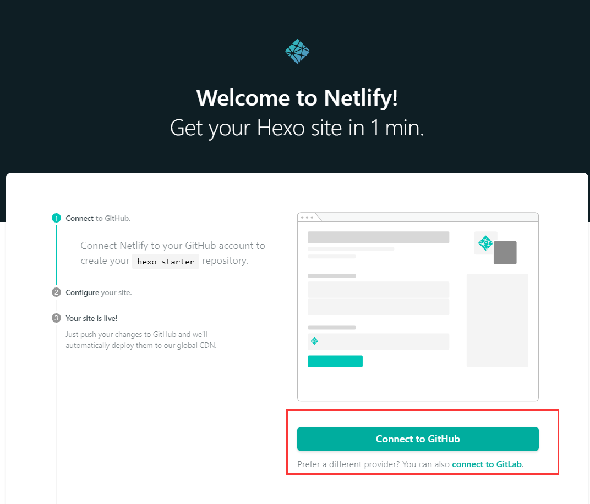


- 创建仓库名，这个名字对应着GitHub上的仓库，因此无需在GitHub上提前创建仓库。并点击保存。

    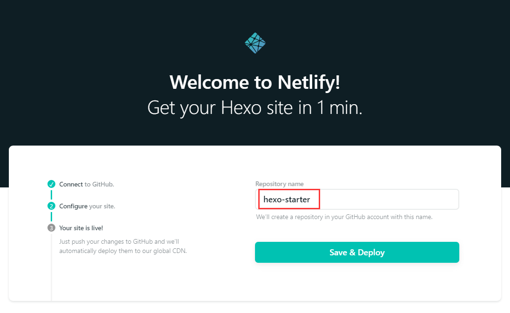

此时可以直接跳到[此处](#更改站点名)

#### 2.	第二种方法

- 在GitHub创建仓库。

    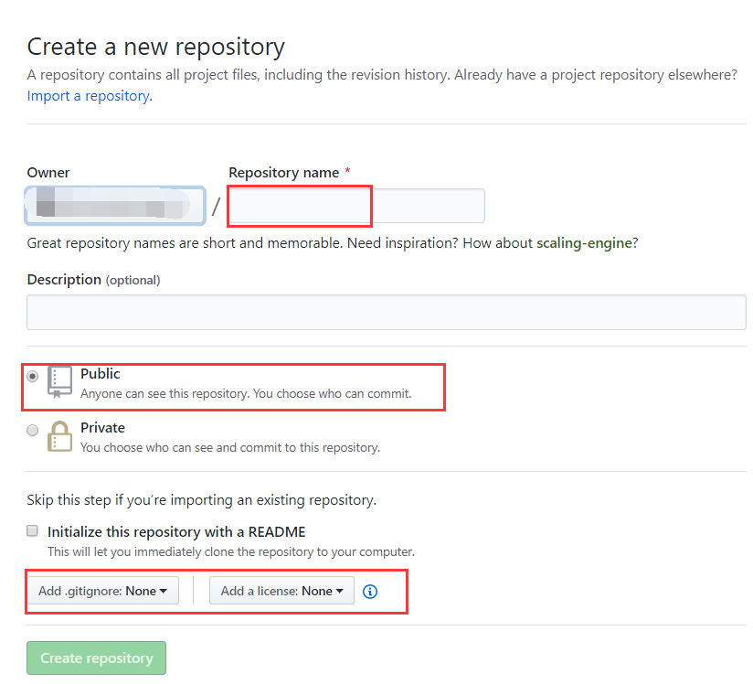

- 进入Netlify官网[https://app.netlify.com/](https://app.netlify.com/)并选择GitHub登录。

    

- 新建Git仓库

    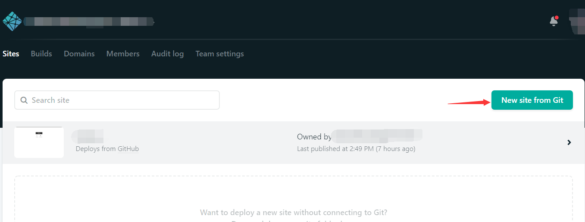

- 选择GitHub，并搜索选择GitHub已经建好的仓库

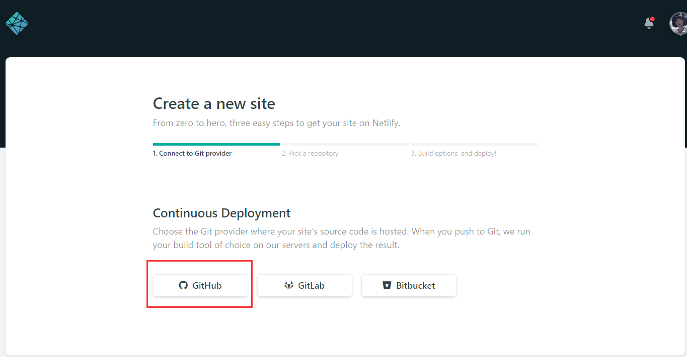

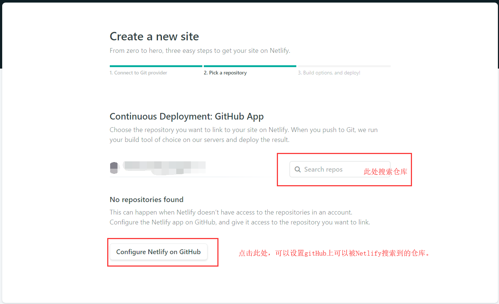

- 部署配置，此处保持默认即可。

    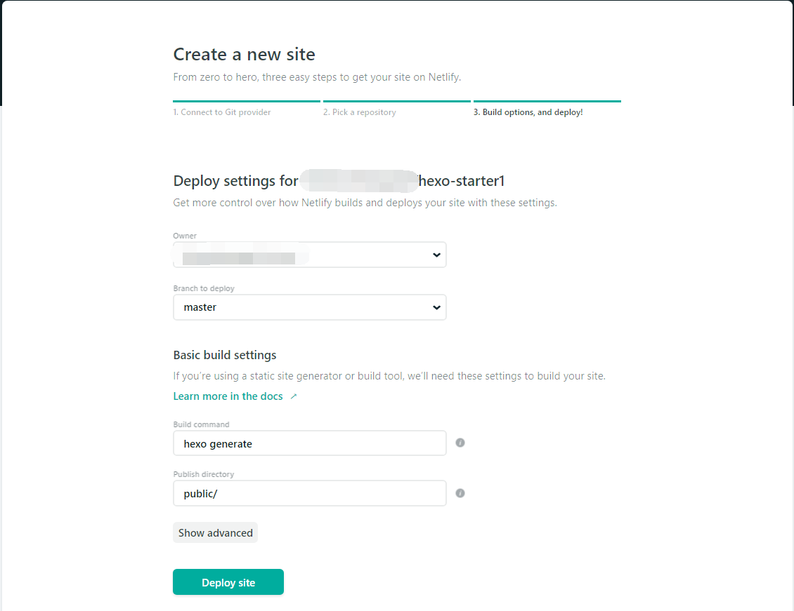

### 2.	更改站点名

- 配置站点名，此时的站点名是随机生成的，用户可以点击Site setting进行设置。

    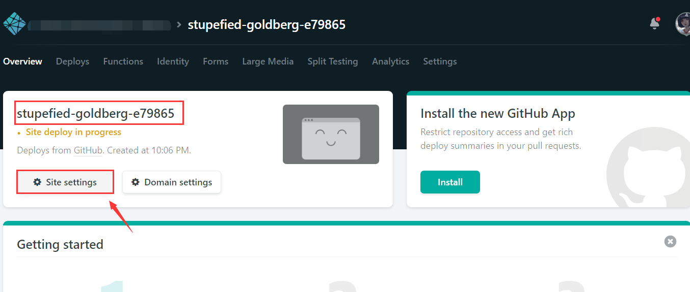

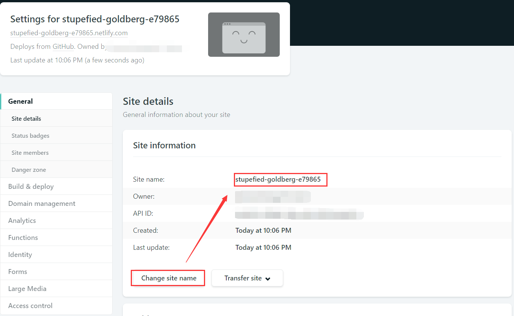

- 等待配置成功，出现你配置的站点名时，则成功，此时需要进行第二步，但第二步还需要关联你已有的域名，此时若是没有域名，而且也不想掏钱的到此为止就可以了（我就是。。。）。

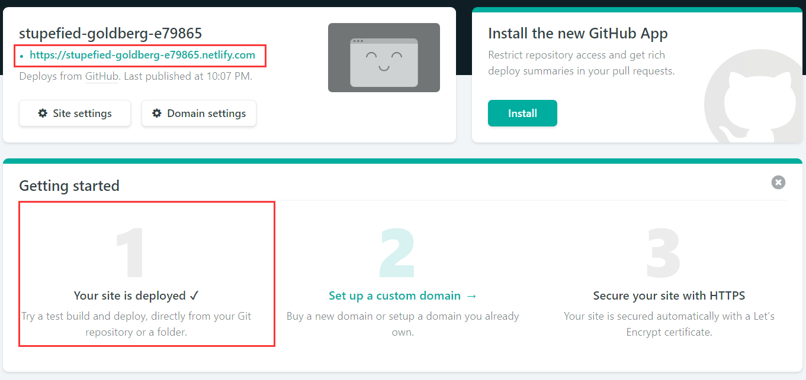

## 使用Typora编写博客时，图片的问题

### 1.	添加插件

- 进入本地博客文件

    ```
    $:cd /d/HexoBlog
    $:npm install https://github.com/CodeFalling/hexo-asset-image --save
    ```

- 修改发布资源配置

    ```
    $:vim _config.yml
    post_asset_folder: true		//修改为true,默认为false
    ```

### 2.	Typora配置

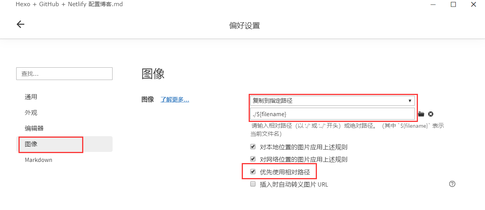

此时在Netlify搭建的博客就可以看到图片了。